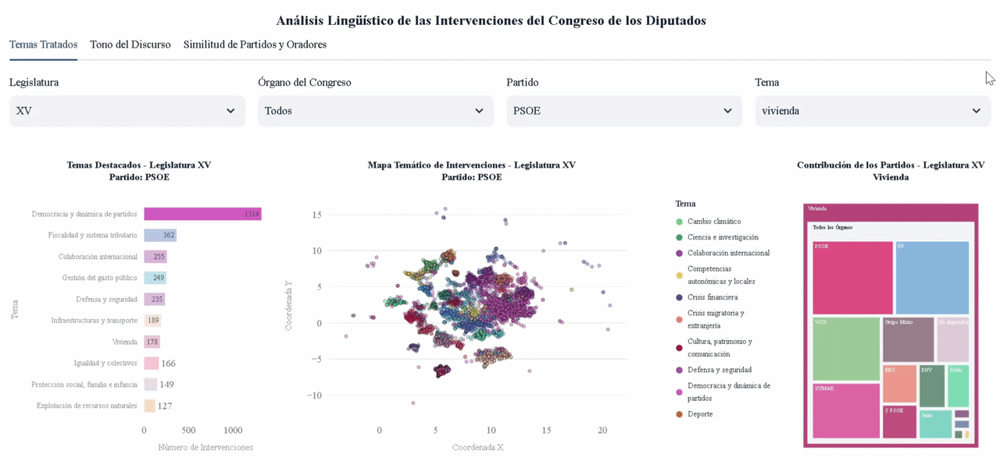

<div align="center">

# **Modelling and Linguistic Analysis of Speeches in the Spanish Congress using NLP**

[](https://www.python.org)
[](https://pytorch.org/)
[](https://huggingface.co/docs/transformers/index)
[](https://congress-nlp-demo.streamlit.app/)
[](./LICENSE)

</div>

<br>

## Project Overview
Parliamentary debate plays a central role in Spanish politics, generating a vast volume of textual data that is difficult to analyse manually. To address this, this project applies **Natural Language Processing (NLP)** techniques to enable systematic, large-scale linguistic analysis.

This study involved constructing a custom corpus of parliamentary speeches collected from the official **Spanish Congress of Deputies** portal, enriched with metadata such as speaker, political party and legislative term. Using this dataset, a linguistic analysis is performed to extract the morphosyntactic structure of sentences, including grammatical categories and syntactic dependencies. Sentiment analysis is also conducted to examine tone, emotions and hostility in language use. In addition, content analysis identifies the main topics addressed in Congress and assesses speech similarity at the party and speaker levels. The results are integrated into a web application for their exploration and interpretation. Despite the homogeneity of parliamentary discourse imposed by the institutional context, particular linguistic patterns emerge across certain political parties and speakers.

## Corpus
The corpus is constructed from official records published on the [Congress of Deputies Open Data Portal](https://www.congreso.es/es/datos-abiertos), covering a large volume of interventions collected between January 13, 2016 and January 11, 2026, including interventions from the Plenary and other bodies of Congress, such as committees and subcommittees.

An *intervention* is defined as the complete speech delivered by a single speaker during their assigned turn in a session.

Each intervention is stored as a JSON record containing the extracted text and associated metadata.

```jsonc
{
    "ID": "DSCD-15-PL-159104BlanquerAlcarazPatricia23138",
    "ORADOR": "Blanquer Alcaraz, Patricia",
    "TEXTO": "Señorías, señor Bravo, ¿qué miedo tiene? No es su estilo. (...)",
    "CARGOORADOR": "Diputada",
    "PARTIDO": "GS",
    "LEGISLATURA": "XV",
    // ...
}
```

## NLP Tasks
- **Morphosyntactic analysis**: enriches the corpus with linguistic information using automated NLP techniques such as PoS tagging and dependency parsing, allowing us to analyse the grammatical and syntactic structure of parliamentary discourse.

<div align="center">

| Grammatical Category | SUMAR | PSOE | PP | VOX |
| :--- | :---: | :---: | :---: | :---: |
| **Nouns** | 17.6% | 17.2% | 16.7% | 17.0% |
| **Verbs** | 10.3% | 9.8% | 10.1% | 10.0% |
| **Adjectives** | 6.4% | 6.1% | 5.7% | 6.1% |
| **Adverbs** | 4.4% | 4.2% | 4.3% | 4.4% |

<sub><b>Table 1:</b> Grammatical category distribution by parliamentary group (XV Legislature).<br>Values indicate the percentage of a party's total words (tokens) assigned to each grammatical category (selected classes displayed for conciseness).</sub>

</div>

<br>

- **Sentiment analysis**: examines the tone of parliamentary discourse using multi-class classification (polarity and emotion recognition) alongside multi-label detection for conflictive language indicators (hate speech, aggressiveness and targeted speech).

<div align="center">

| Emotion | SUMAR | PSOE | PP | VOX |
| :--- | :---: | :---: | :---: | :---: |
| **Anger** | 19.7% | 16.4% | 23.5% | **30.6%** |
| **Joy** | 1.9% | **2.7%** | 1.2% | 0.9% |

<sub><b>Table 2:</b> Emotion distribution by parliamentary group (XV Legislature).<br>Values indicate the percentage of a party's total sentences assigned to each emotion (selected classes from the multi-class model).</sub>

</div>

<br>

> ***Note on political context:*** Differences in emotional tone primarily reflect institutional roles within the parliament (government vs opposition).

<br>

<div align="center">

| Toxic Discourse | SUMAR | PSOE | PP | VOX |
| :--- | :---: | :---: | :---: | :---: |
| **Hate Speech** | 7.7% | 6.0% | 7.4% | **10.9%** |
| **Aggressiveness** | 2.4% | 2.0% | 2.4% | **3.7%** |

<sub><b>Table 3:</b> Prevalence of conflictive language indicators (XV Legislature).<br>Values indicate the percentage of a party's total sentences flagged for each independent metric (selected classes from the multi-label model).</sub>

</div>

<br>

- **Topic modelling**: identifies the main topics discussed in Congress and groups interventions according to their thematic content.

<div align="center">

| Topic | SUMAR | PSOE | PNV | Junts |
| :--- | :---: | :---: | :---: | :---: |
| **International Cooperation** | 3.5% | **5.9%** | 2.6% | 1.5% |
| **Justice and Criminal Law** | 1.4% | 1.3% | 2.4% | **3.9%** |
| **Labour Legislation** | **3.7%** | 1.7% | 2.6% | 2.3% |
| **Public Expenditure Management** | 1.2% | 1.9% | **5.8%** | 1.5% |
| **Taxation and Tax System** | 2.4% | 2.2% | **7.8%** | 4.3% |

<sub><b>Table 4:</b> Topic distribution by parliamentary group (XV Legislature).<br>Values represent the percentage of a party's total interventions dedicated to each topic (selected classes displayed for conciseness).</sub>

</div>

<br>

- **Lexical and semantic similarity**: measures the similarity between interventions from different parties and speakers based on their vocabulary and semantic content.

<div align="center">

| Metric (Baseline: SUMAR) | Bildu | ERC | PSOE | PP | VOX |
| :--- | :---: | :---: | :---: | :---: | :---: |
| **Lexical Similarity (Rank)** | #5 | **#1** | #3 | #4 | #2 |
| **Semantic Similarity** | **98.7%** | **98.6%** | **98.7%** | 97.5% | 97.0% |

<sub><b>Table 5:</b> Pairwise textual similarity relative to SUMAR (XV Legislature).<br>Lexical values denote vocabulary overlap rank; semantic values represent cosine similarity computed over text embeddings.</sub>

</div>


## Usage
```bash
# Install dependencies
pip install -r requirements.txt

# Data Preparation
python src/stage1_corpus/speech_extraction.py

# Morphosyntactic Analysis
python src/stage2_morphosyntax/morphosyntactic_analysis.py

# Topic Modelling
python src/stage3_semantics/topic_modeling.py

# Sentiment Analysis
python src/stage3_semantics/sentiment_analysis.py
python src/stage3_semantics/sentiment_mapping.py

# Lexical and Semantic Similarity Analysis
python src/stage3_semantics/similarity_analysis.py

```

## Demo

<div align="center">



<br>

[](https://congress-nlp-demo.streamlit.app/)

</div>


## Tools
- [PyTorch 2.7.1](https://pytorch.org/): machine learning framework used for the efficient implementation of deep learning models, including GPU acceleration.
- [PyMuPDF 1.26.1](https://pymupdf.io/): library for extracting and processing text, images, and metadata from PDF documents.
- [Stanza 1.10.1](https://stanfordnlp.github.io/stanza/): NLP toolkit used for tokenisation, lemmatisation, PoS tagging, morphological analysis, and dependency parsing.
- [Hugging Face Transformers](https://huggingface.co/docs/transformers/index): open-source library used to access and run state-of-the-art language models for NLP tasks.
- [Gensim 4.3.3](https://radimrehurek.com/gensim/): NLP library designed for natural language processing and information retrieval, specialised in topic modelling and document indexing.

<br>

---
> **Licence:** This project is released under the [MIT License](./LICENSE).

> **Data Source:** Speech data collected from the [Congress of Deputies Open Data Portal](https://www.congreso.es/es/datos-abiertos), covering the period 13 January 2016 – 11 January 2026, in accordance with its [legal notice](https://www.congreso.es/es/cem/aviso-legal).

> **Academic Context:** Developed as part of a Bachelor's Thesis in Data Science and Engineering at the Universidade da Coruña.